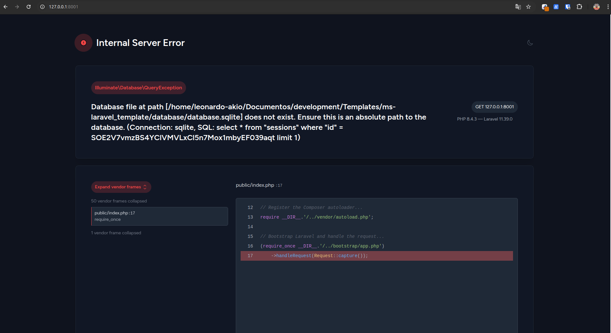

## Namespace (src)

## Etapas:

1. Utilizar a IDE para realizar o refactor alterando o nome a pasta `app` para `src` onde acarretará nas mudanças:
   - Os arquivos `AppServiceProvider`, `Controller`, `User` serão movidos para o novo namespace `src`
   - Dentro do arquivo `composer.json`
   ```shell
    "autoload": {
        "psr-4": {
            # "App\\": "app/",
            "App\\": "src/",
            "Database\\Factories\\": "database/factories/",
            "Database\\Seeders\\": "database/seeders/"
        }
    },
    ```
    - Dentro do arquivo `boostrap/app.php`
   ```shell
    # return Application::configure(basePath: dirname(__DIR__))
    $app = Application::configure(basePath: dirname(__DIR__))
        ->withRouting(
            web: __DIR__.'/../routes/web.php',
            commands: __DIR__.'/../routes/console.php',
            health: '/up',
        )
        ->withMiddleware(function (Middleware $middleware) {
            //
        })
        ->withExceptions(function (Exceptions $exceptions) {
            //
        })
        # Finalizava aqui
        ->create();
    
    $app->useAppPath($app->basePath('src'));
    
    return $app;
    ```
2. Agora apenas teste a execução com o comando `php artisan serve` e se carregar a página do Laravel, a alteração foi realizada com sucesso
   
  <br/>


   **_OBS: Certifique-se de ter os arquivos `.vendor` e `.env` para testar**_ 
